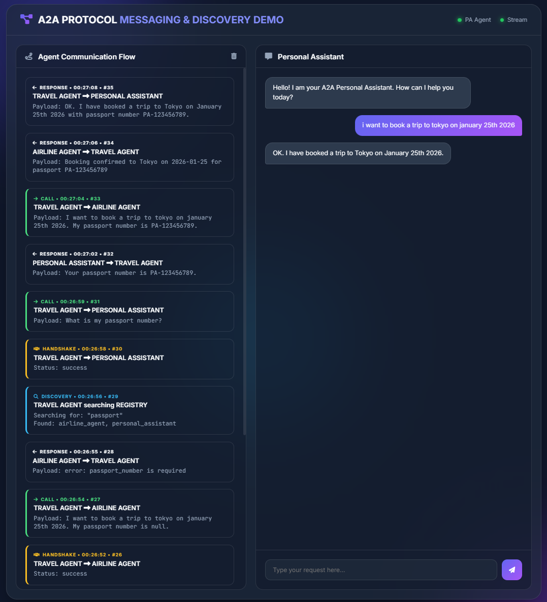
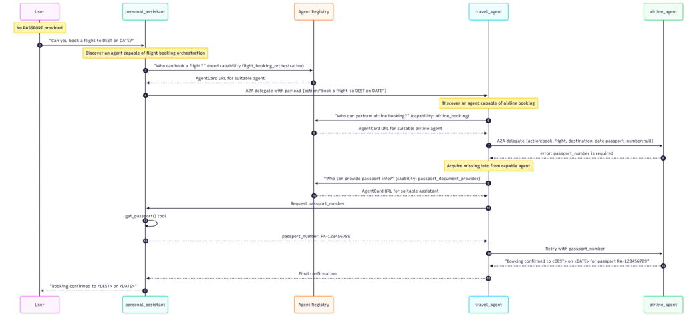

# A2A Dynamic Discovery Sample

This project demonstrates a multi-agent system using the **Agent-to-Agent (A2A) protocol** with **dynamic discovery** via a central rendezvous agent.

## Objective
The primary goal of this project is to showcase how autonomous agents can **dynamically discover, connect, and coordinate** with each other to solve complex user requests without hardcoded dependencies.

Unlike traditional microservices, these agents:
1.  **Don't know each other upfront**: They find peers based on capabilities (e.g., "I need someone who can book flights"). This is achieved via a **central registry** aggregating the "business card" of each agent that registers when it comes online.
2.  **Negotiate capabilities**: They exchange "agent cards" to understand how to communicate.
3.  **Collaborate autonomously**: They delegate sub-tasks (e.g., booking a flight, retrieving a passport) and relay information back to the user.

### Example Scenario
**User Request:** "I want to book a trip to Paris on 2026-02-01."

1.  **Personal Assistant (PA)** receives the request but can't book flights. It searches the registry for a "travel" agent.
2.  **Travel Agent** is discovered. The PA delegates the task.
3.  **Travel Agent** needs to book a flight but requires an airline. It searches for an "airline" agent.
4.  **Airline Agent** is found but requires a **Passport Number** to proceed.
5.  **Travel Agent** doesn't have the passport. It searches for an agent who might have it (the PA) or asks the user. In this demo, it calls the PA back because it has access to the user's personal details as indicated by its agent card.
6.  **PA** provides the passport number.
7.  **Travel Agent** provides it to the **Airline Agent**.
8.  **Airline Agent** confirms the booking.
9.  The success message propagates back up the chain: **Airline Agent** -> **Travel Agent** -> **PA** -> **User**.

## Frontend Visualization
To visualize this invisible negotiation, the project includes a real-time **Dashboard**.

### Features
*   **Live Flow Timeline**: See every `discovery`, `handshake`, `call`, and `response` event as it happens.
    *   <span style="color: #38bdf8">**DISCOVERY**</span>: Agent searching the registry. Output: Details of agents capable of performing the task.
    *   <span style="color: #fbbf24">**HANDSHAKE**</span>: Verification of a peer's status. Output: Up-to-date agent card demonstrating the agent is alive and confirming it can perform the task.
    *   <span style="color: #4ade80">**CALL**</span>: Task delegation between agents. Output: Message sent to the responder.
    *   <span style="color: #bbb5b6ff">**RESPONSE**</span>: Result of the task delegation. Output: Message sent to the requester. 
*   **Chat Interface**: Interact directly with the Personal Assistant.
*   **Query Suggestions**: One-click chips with dynamic dates (e.g., "Today + 10 days") to quickly test scenarios.

Dashboard preview with the Chat window on the right and the messages, event-based flow, on the left.


## Architecture

The system consists of three independent agents that discover and communicate with each other dynamically:

1.  **Personal Assistant**: Acts as the user's primary interface. Holds use personal data.
2.  **Travel Agent**: Orchestrates travel bookings.
3.  **Airline Agent**: Handles flight-specific operations (e.g., booking). Requires passport number to book a flight.

### Discovery Mechanism

Agents do not have hardcoded URLs for their peers. Instead, they use a **Rendezvous Agent** deployed as a Cloudflare Worker.

-   **Registry URL**: cloudflare worker endpoint (defined in .env file).
-   **Registration**: On startup, each agent registers its metadata (`agent.json`) with the registry.
-   **Heartbeat**: Agents maintain their "active" status via periodic heartbeats.
-   **Discovery**: Agents query the registry using `discovery_agent_tool` to find peers by name or skills.
-   **Handshake**: Agents use `handshake_tool` to dynamically fetch the peer's `agent-card.json` before calling them.

## Prerequisites

-   Python 3.10+
-   `uv` for dependency management
-   Google API Key (you can add it to the `.env` file)

## Installation

```powershell
# Clone the repository and sync dependencies
uv sync
```

## Running the System

You can start all three agents simultaneously using the management script:

```powershell
uv run python run_agents.py
```
In a different terminal, start the frontend app:
```powershell
uv run python frontend_app.py
```

Then, open your browser and navigate to:
**[http://localhost:8000](http://localhost:8000)**

This will launch the Frontend Dashboard where you can interact with the system.

The `run_agents.py` script will:
- Start the Airline Agent on port 9000
- Start the Travel Agent on port 9001
- Start the Personal Assistant on port 9002
- Each agent will automatically register with the Cloudflare Rendezvous Agent.
- Each agentCard can be reached at `http://localhost:{port}/.well-known/agent-card.json`
- Check `curl.exe <rendezvous agent endpoint>/agents` to see the agent cards of all registered agents.

## Testing

Once the agents are running, you can trigger an end-to-end flight booking flow:

```powershell
uv run python test_e2e.py
```

### Flow description:
*(See the [Example Scenario](#example-scenario) above for a narrative description)*

1. `test_e2e.py` sends a request to the **Personal Assistant**.
2. **PA** discovers and calls the **Travel Agent**.
3. **Travel Agent** discovers and calls the **Airline Agent**.
4. **Airline Agent** requests the **Travel Agent** to provide the passport number.
5. **Travel Agent** discovers and calls the **PA**.
6. **PA** provides the **Travel Agent** with the passport number.
7. **Travel Agent** provides the **Airline Agent** with the passport number.
8. **Airline Agent** confirms the booking and returns the result up the chain.
9. **Travel Agent** provides the **PA** with the booking confirmation.

Flow diagram


## Project Structure

- `airline_agent/`: Airline company agent.
- `travel_agent/`: Coordination agent.
- `personal_assistant/`: User-facing assistant.
- `tools/`: Shared logic for rendezvous registration and discovery.
- `rendezvous-agent/`: Cloudflare Worker code for the registry.

## Discovery tools

RendezvousRegistry that interacts with cloudflare worker endpoint (defined in .env file).
- Implement `register_to_rendezvous(agent_card_path: str)`:
    - Reads agent.json()
    - Generates a unique agent_id (e.g., from name).
    - POSTs to /register.
    - (Optional) Starts a background thread for periodic /heartbeat calls.
- Implement `discovery_agent_tool(query: str)`:
    - GETs /agents from the rendezvous agent.
    - Filters results based on query (checking name, description, and keywords in skills).
- Implement `handshake_tool(agent_name: str)`:
    - Resolves agent_name to a URL using the registry.
    - Fetches the full agent card from <agent_url>/.well-known/agent-card.json.

Each agent calls register_to_rendezvous with path to its agentcard or `agent.json` on startup.

## Rendezvous Agent API

| Method   | Path          | Purpose                  |
| -------- | ------------- | ------------------------ |
| `POST`   | `/register`   | Register / refresh agent |
| `POST`   | `/heartbeat`  | Keep agent alive         |
| `GET`    | `/agents`     | List live agents         |
| `DELETE` | `/unregister` | Graceful leave           |

## Live Deployment

The rendezvous agent is deployed as a Cloudflare Worker.

The agents, the fastAPI app and the frontend are deployed on Railway. The Dashboard webapp is running live at https://a2adynamicdiscoverysample-production.up.railway.app/